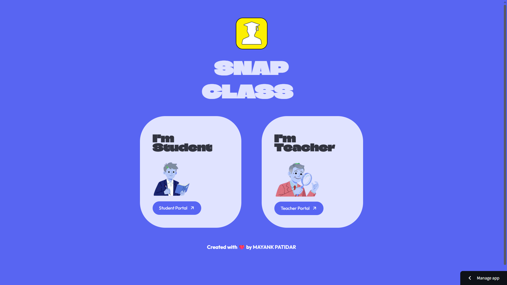
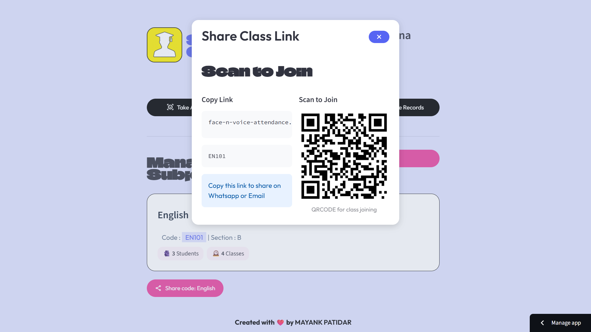
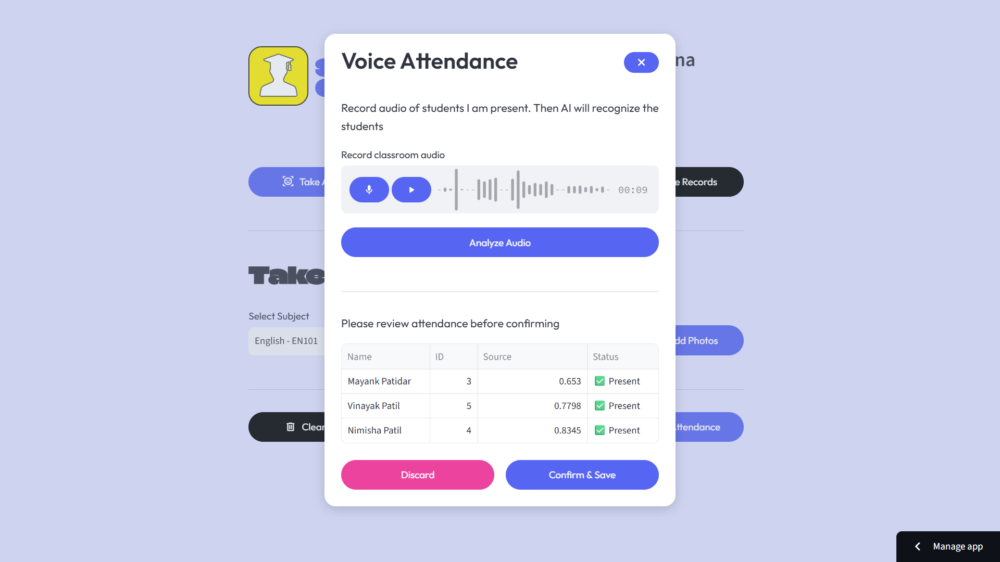
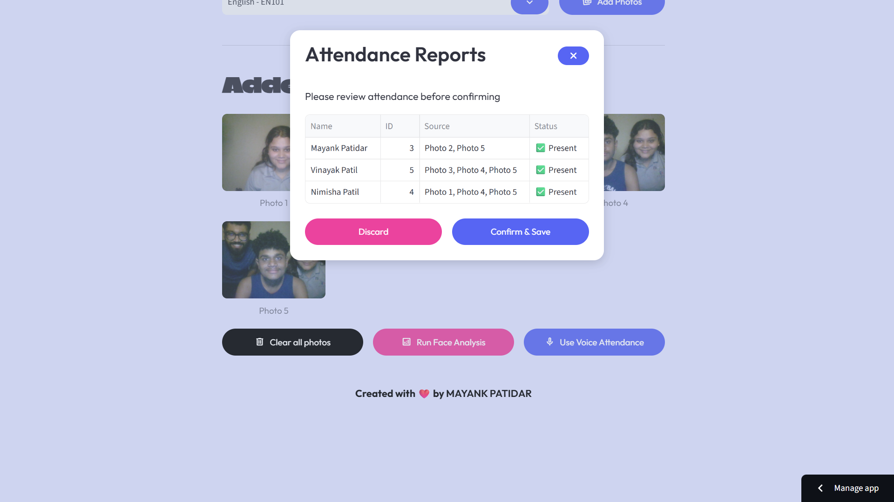
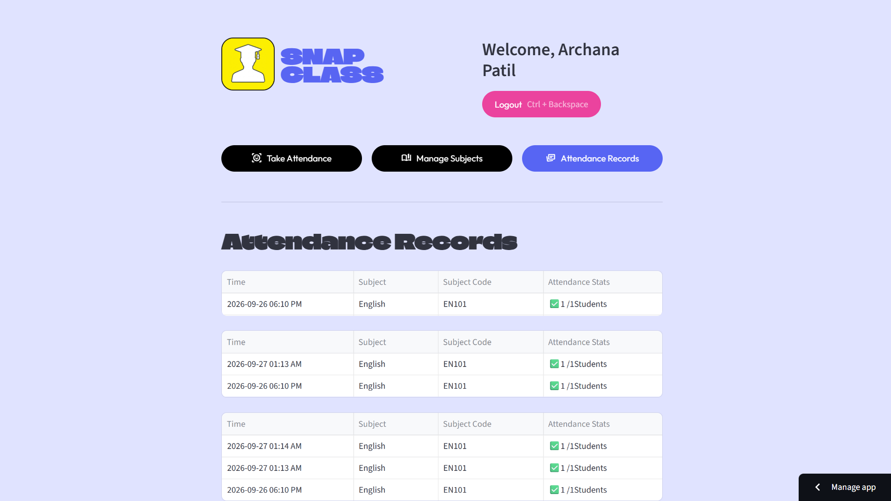

# SnapClass – Multimodal AI Attendance Management Platform

SnapClass is a multimodal attendance management platform that automates classroom attendance using Face Recognition and Voice Recognition pipelines. The system enables teachers to create subjects, enroll students, share class invitations, and generate attendance records through AI-powered verification.

---

## 🌐 Landing Page


## 👨‍🏫 Teacher Dashboard


## 📚 Subject Management


## 🔗 QR-Based Enrollment


## 🎤 Voice Attendance Verification


## 👤 Face Recognition Attendance


## 📊 Attendance Analytics & Reports


## 🚀 Features

- Face Recognition Attendance
- Voice Recognition Attendance
- Subject & Classroom Management
- Student Enrollment System
- QR-Based Class Joining
- Attendance Reports & Analytics
- Teacher & Student Dashboards
- Secure Attendance Verification
- Streamlit Deployment
- Responsive Web Interface

---

## 🛠 Tech Stack

### AI & Machine Learning
- Face Recognition
- Voice Recognition
- OpenCV
- NumPy
- Scikit-Learn

### Backend & Application
- Python
- Streamlit

### Database
- Supabase
- PostgreSQL

### Deployment
- Streamlit Cloud
- Vercel

---

## 📂 Project Structure

```text
app.py

src/
├── components/
│   ├── dialog_add_photo.py
│   ├── dialog_attendance_result.py
│   ├── dialog_auto_enroll.py
│   ├── dialog_create_subject.py
│   ├── dialog_enroll.py
│   ├── dialog_share_subject.py
│   ├── dialog_voice_attendance.py
│   ├── footer.py
│   ├── header.py
│   └── subject_card.py
│
├── database/
│   ├── config.py
│   └── db.py
│
├── pipelines/
│   ├── face_pipeline.py
│   └── voice_pipeline.py
│
├── screens/
│   ├── home_screen.py
│   ├── student_screen.py
│   └── teacher_screen.py
│
└── ui/
    └── base_layout.py
```

---

## 🏗 Architecture

```text
Teacher Dashboard
        │
        ▼
Subject Management
        │
        ▼
Student Enrollment
        │
        ▼
Attendance Collection
      /         \
     /           \
 Face AI      Voice AI
     \           /
      \         /
        ▼      ▼
Attendance Verification
        │
        ▼
Attendance Reports
```

---

## 💡 Engineering Highlights

- Developed independent Face Recognition and Voice Recognition pipelines for multimodal attendance verification.
- Designed a modular architecture using reusable UI components, screens, pipelines, and database layers.
- Integrated Supabase PostgreSQL backend for subject management, enrollment workflows, and attendance storage.
- Implemented QR-based classroom onboarding with shareable enrollment links.
- Built teacher and student dashboards for attendance management and reporting.
- Engineered end-to-end deployment pipeline using Streamlit Cloud and Vercel.
- Developed reusable dialog-driven interfaces for enrollment, attendance review, reporting, and subject management workflows.
- Followed production-style software architecture with separation of concerns and scalable component organization.

---

## 🔗 Project Links

### Live Demo
https://snap-class-landing-page-delta.vercel.app/

## 🔮 Future Improvements

- DeepFace Integration
- Speaker Embedding Models
- Real-Time Classroom Attendance
- Attendance Analytics Dashboard
- Mobile Application
- AI Teaching Assistant

---

## 👨‍💻 Author

**Mayank Patidar**

B.Tech Artificial Intelligence & Data Science  
LNCT Bhopal

GitHub: https://github.com/mayankptdr

---
